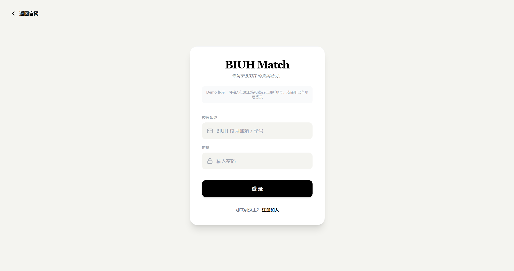
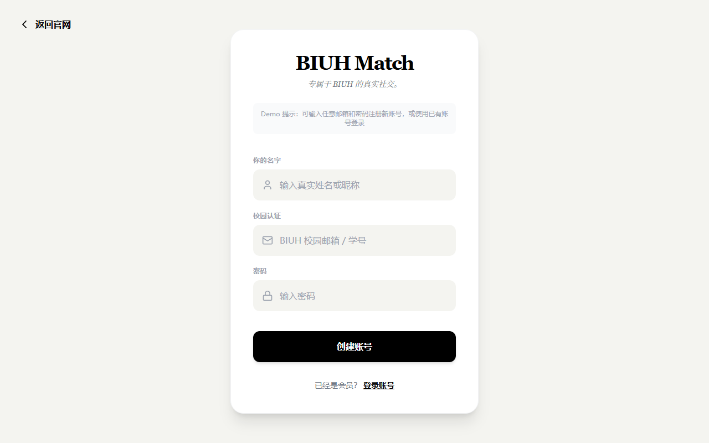
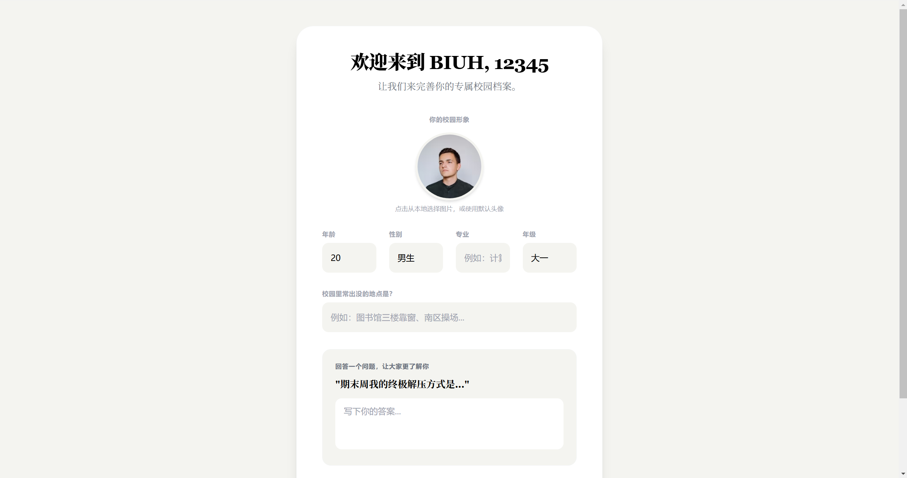
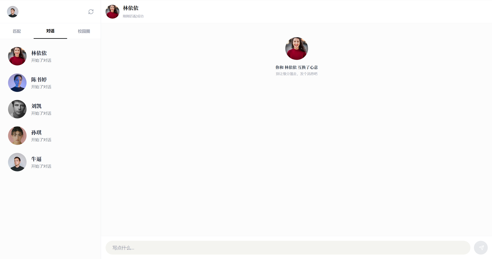
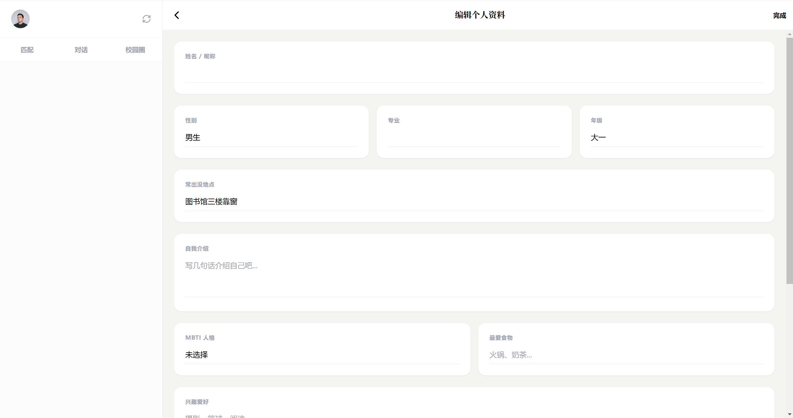
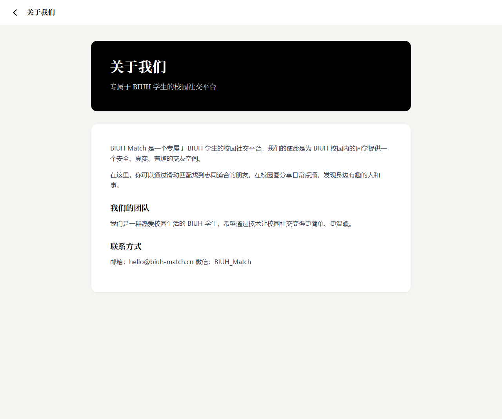
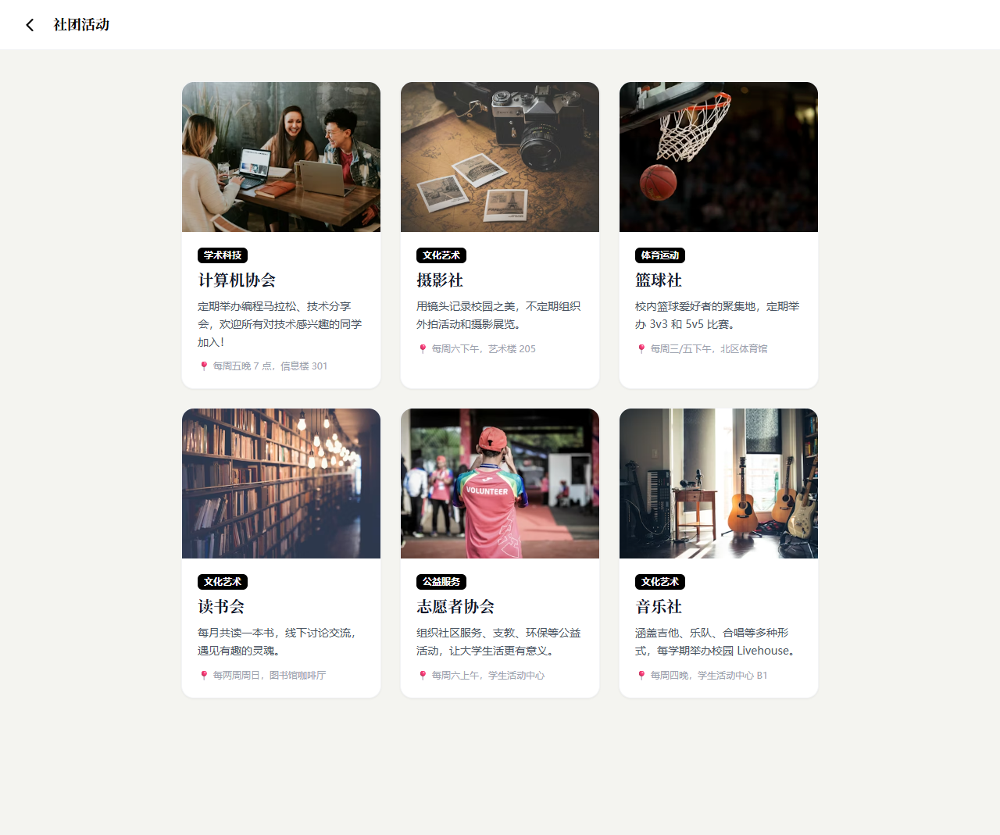
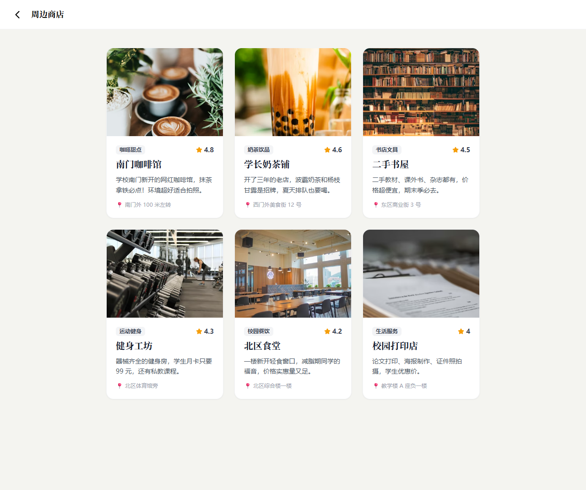
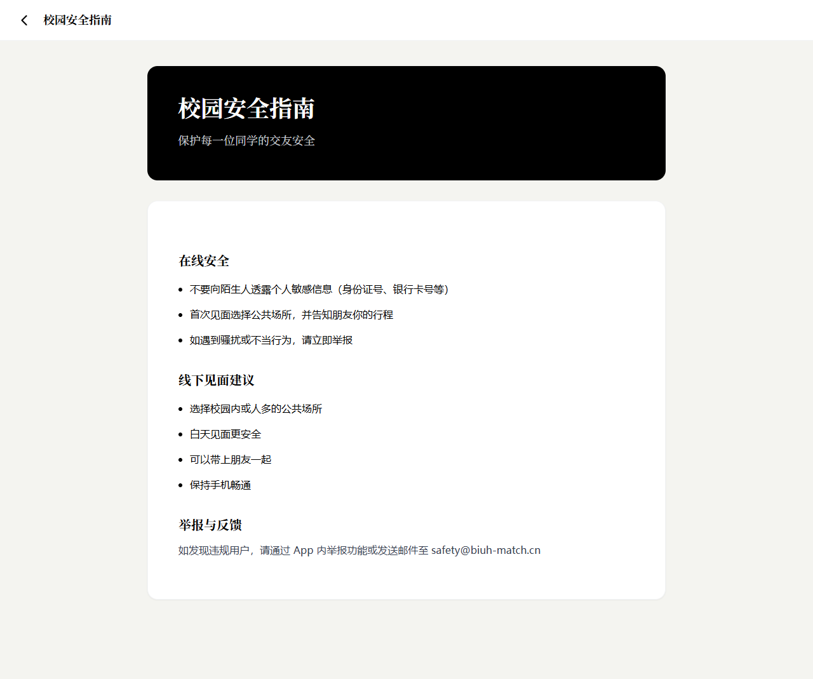

# 💖 BIUH-Tinder — 北师港浸大校园社交匹配平台

BIUH-Tinder 是一个面向海南比勒费尔德应用科学大学（BIUH）学生的校园社交匹配 Web 应用。灵感来自 Tinder，集成了用户发现、智能匹配、校园圈动态、社团活动、周边商店等丰富功能，旨在为 BIUH 校园生活增添社交乐趣。

---

## 📸 应用截图

### 🏠 着陆页 (Landing Page)
应用的入口页面，展示品牌形象与核心功能入口，用户可选择登录或注册。


### 🔐 登录页 (Login Page)
用户通过邮箱和密码登录已有账户，简洁的表单设计提供流畅的登录体验。



### 📝 注册页 (Register Page)
新用户创建账户，填写基本信息（姓名、邮箱、密码）即可快速注册。



### 🎯 引导页 (Onboarding)
首次登录后的资料完善引导页面，用户可以补充个人照片、兴趣、MBTI、专业、年级等详细信息，提升匹配质量。



### 🔍 发现页 (Discover)
核心功能页面——卡片滑动式用户发现，浏览推荐的校园用户资料，支持左滑/右滑操作进行匹配。集成星型图匹配算法，按专业、年级、地点、兴趣等多维度计算匹配度并排序推荐。


### 📱 校园圈 (Moments)
类似朋友圈/Instagram 的校园动态功能。用户可以发布图文动态、添加标签、点赞和评论，支持按热门标签筛选内容。


### 💬 消息页 (Messages)
已匹配用户之间的即时聊天界面，查看对话列表并发送消息，促进用户间的真实交流。



### 👤 个人资料页 (Profile)
展示和管理个人资料，包括头像、照片墙、个性签名、兴趣标签、MBTI、星座等详细信息。支持编辑个人资料和上传照片。



### ℹ️ 关于我们 (About)
项目介绍页面，展示 BIUH-Tinder 的团队信息与项目愿景。



### 🏫 社团活动 (Clubs)
校园社团活动信息展示，浏览 UIC 各类社团的详细介绍与最新活动。



### 🛍️ 周边商店 (Shops)
校园周边商店推荐，按评分排序展示各类商户信息，方便学生发现周边美食与服务。



### 🛡️ 安全指南 (Safety)
社区安全指南页面，提供社交安全建议和使用规范，保障用户安全。



---

## ✨ 核心功能

| 功能模块 | 描述 |
|---------|------|
| 👤 用户系统 | 注册/登录、个人资料管理、照片墙上传 |
| 🔍 用户发现 | 卡片式浏览推荐用户，左滑/右滑匹配 |
| ⭐ 星型图匹配 | 基于专业、年级、地点、兴趣的多维度智能匹配算法 |
| 💬 即时消息 | 匹配用户间一对一实时聊天 |
| 📱 校园圈 | 发布图文动态、标签、点赞、评论互动 |
| 🏫 社团活动 | 浏览校园社团信息与活动 |
| 🛍️ 周边商店 | 校园周边商户推荐 |
| 🛡️ 安全指南 | 社区安全使用规范 |

---

## 🛠️ 技术栈

### 前端
- **React 19** — UI 组件化开发
- **Vite** — 极速构建工具
- **Tailwind CSS** — 原子化 CSS 框架
- **React Router** — 单页应用路由

### 后端
- **Node.js + Express** — RESTful API 服务
- **SQLite (better-sqlite3)** — 轻量级数据库
- **JWT + bcryptjs** — 用户认证与密码加密
- **Multer** — 文件上传处理

---

## 📂 项目结构

```
BIUH-Tinder/
├── public/                  # 静态资源
│   ├── favicon.svg
│   └── icons.svg
├── server/                  # 后端服务
│   ├── index.js             # Express 服务入口 & API 路由
│   ├── db.js                # 数据库初始化与种子数据
│   ├── biuh-match.db        # SQLite 数据库文件
│   ├── package.json         # 后端依赖
│   └── uploads/             # 用户上传文件
├── src/                     # 前端源码
│   ├── main.jsx             # React 入口
│   ├── App.jsx              # 主应用组件（路由 & 页面）
│   ├── App.css              # 应用样式
│   ├── index.css            # 全局样式
│   └── assets/              # 图片等静态资源
├── img/                     # 项目截图
├── index.html               # HTML 模板
├── vite.config.js           # Vite 配置
├── tailwind.config.js       # Tailwind CSS 配置
├── postcss.config.js        # PostCSS 配置
├── eslint.config.js         # ESLint 配置
└── package.json             # 前端依赖与脚本
```

---

## 🚀 快速开始

### 前置条件
- Node.js >= 18
- npm

### 安装与运行

1. **克隆项目**
   ```bash
   git clone https://github.com/zoyk1/Biuh-Tinder.git
   cd BIUH-Tinder
   ```

2. **安装前端依赖**
   ```bash
   npm install
   ```

3. **安装后端依赖**
   ```bash
   cd server
   npm install
   cd ..
   ```

4. **启动后端服务**（终端 1）
   ```bash
   cd server && node index.js
   ```
   后端运行在 `http://localhost:3001`

5. **启动前端开发服务器**（终端 2）
   ```bash
   npx vite
   ```
   前端运行在 `http://localhost:5173`

---

## 🔌 API 概览

| 方法 | 路径 | 说明 |
|------|------|------|
| POST | `/api/auth/register` | 用户注册 |
| POST | `/api/auth/login` | 用户登录 |
| GET | `/api/auth/me` | 获取当前用户（需认证） |
| GET | `/api/users/:id` | 获取用户资料 |
| PUT | `/api/users/:id` | 更新用户资料 |
| GET | `/api/users/:id/discover` | 获取推荐用户队列 |
| GET | `/api/users/:id/discover-graph` | 星型图匹配数据 |
| POST | `/api/matches` | 创建匹配 |
| GET | `/api/matches/:userId` | 获取匹配列表 |
| GET | `/api/messages/:matchId` | 获取聊天消息 |
| POST | `/api/messages` | 发送消息 |
| GET | `/api/moments` | 获取校园圈动态 |
| POST | `/api/moments` | 发布动态 |
| POST | `/api/moments/:id/like` | 点赞/取消点赞 |
| POST | `/api/moments/:id/comments` | 添加评论 |
| GET | `/api/clubs` | 获取社团列表 |
| GET | `/api/shops` | 获取周边商店 |
| GET | `/api/pages/:id` | 获取页面内容 |
| POST | `/api/upload` | 通用文件上传 |
| POST | `/api/users/:id/photos` | 上传用户照片 |

---

## 🧠 匹配算法

BIUH-Tinder 采用多维度的星型图匹配算法，综合计算用户间的匹配度：

| 维度 | 权重 | 匹配逻辑 |
|------|------|---------|
| 专业 | 30% | 相同专业满分，包含关系部分分 |
| 年级 | 25% | 相同年级满分，差距越小分越高 |
| 地点 | 20% | Jaccard 相似度计算地点重叠 |
| 兴趣 | 15% | 关键词交集占比计算 |
| 基础分 | 10% | 所有用户保底基础分 |

---

## 📄 许可证

MIT License

---

> 💡 BIUH-Tinder — 为 UIC 校园生活增添社交乐趣的校园匹配平台。
